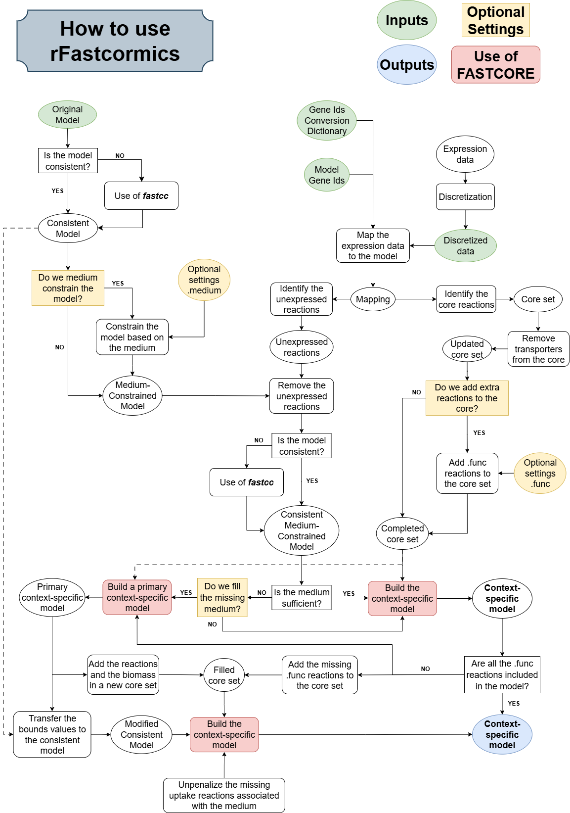

## What is rFASTCORMICS_v2?
rFASTCORMICS is an algorithm for the reconstruction of context-specific metabolic models based on RNA-seq data that has first been published in 2019 (https://doi.org/10.1016/j.ebiom.2019.04.046). 
Here, we provide an updated version of rFASTCORMICS, called rFASTCORMICS_v2.

## What will you find on this repository?
On this repository, you will find:
- A `README.md` file, containing a description of this repository, documentation of the tool, and some tutorials.
- A *scripts* folder, containing the scripts of rFASTCORMICS_v2, and the ones of FASTCORE. It is important to use the functions from this FASTCORE folder instead of the one included in the COBRA Toolbox, as some changes were also made on these functions and that they are called in rFASTCORMICS_v2. The two folders can directly be associated with to the COBRA Toolbox.
- A *BRCA_example* folder, containing materials and a script to run an example using rFASTCORMICS_v2. The `test_script.m` file can be run directly. It will load the `workspace_example` and the `optionalSettings` files. The `finalWorkspace` file contains all the variables after the script has finished running.

## What are the main changes between rFASTCORMICS and rFASTCORMICS_v2?
1. Instead of not penalizing the addition of transporters in the model, we removed the nonPen argument and rather decided to remove transporters from the core set of reactions. In this way, we make sure only the necessary transporters will be included in the model.
2. The FASTCORE algorithm is run only once instead of twice, reducing the time of execution of rFASTCORMICS_v2.

## Installation
rFASTCORMICS_v2 requires MATLAB 2019 or a later version and works with the IBM CPLEX or Gurobi solvers.  The user also needs to install the COBRA Toolbox. As mentioned previously, both FASTCORE and rFASTCORMICS_v2 folders in the *scripts* folders sould be downloaded. The FASTCORE folder already included in the COBRA Toolbox should be replaced by the one provided here.

## How to use rFastcormics_v2?
Here is the workflow of rFastcormics_v2:

**Usage**

`[contextSpecificModel, retainedRxns] = rFastcormics4cobra_v2(model, discretized, rownames, dico, consensusProportion, epsilon, optionalSettings, biomassReactionName, fillingMediumFlag, adaptiveScalingFlag)`

| **Inputs** | **Description** |
|--------------|-----------------|
| `model`      | metabolic model (following fields are required: S, lb, ub, rxns, metFormulas) |
| `discretized` | matrix with the discretized value (1, 0, or -1) for each gene and sample (as many rows as the number of genes, as many columns as the number of samples) |
| `rownames` | cell array with the gene IDs (as many rows as the number of genes in `discretized`) |
| `dico` | table with two columns, first for gene IDs in the `model` format, second for gene IDs in the `discretized` format |
| **Optional inputs** | 
| `consensusProportion` | the rate of samples that have to express or not to express a gene for the gene to be considered expressed or not (default 0.9) |
| `epsilon` | smallest flux that is considered nonzero (default getCobraSolverParams('LP', 'feasTol')*100 = 1e-4) |
| `optionalSettings.func` | cell array of reaction abbreviations that should carry a flux   It is recommended to put the objective function of your model to ensure its preservation in the context-specific model. Any reaction included in the .func will necessarily appear in the final model.|
| `optionalSettings.medium` | cell array of metabolite abbreviations that are present in the growth medium of the cells and that will be used to constrain the model |
| `optionalSettings.notMediumConstrained` | ??? |
| `biomassReactionName` | string or character array with the name of the objective/biomass reaction |
| `fillingMediumFlag` | fill the medium with supplementary reactions in case the provided medium is not sufficient to fulfill the objective function  1 for active (default), 0 for inactive |
| `adaptiveScalingFlag` | adaptive scaling of the flux values (see LP10) 0 for inactive (default), 1 for active |
| **Outputs** |
| contextSpecificModel | context-specific model, reduced to the retained reactions and associated genes |
| retainedRxns | indices in `model` of the retained reactions |
| indicesCompletedCoreOrig | indices of the core reactions in the input model |

## Option to supplement an insufficient medium

When a model is constrained by a medium, it can sometimes be insufficient to allow flux through the model’s objective function (often biomass) or, in some cases, to even retain this reaction within the model. We have included a medium sufficiency check in the rFastcormics_v2 workflow.  When the medium is insufficient, an optional argument (`missingMediumFlag`, enabled by default) allows the medium to be supplemented by running the fastcore algorithm a second time. The core set of reactions is updated to include all reactions selected to be part of the context-specific model, as well as the exchange reactions associated with the medium metabolites that may have been excluded during the medium-constraining step (`optionalSettings.medium`).
  <b>Note</b>: If the context-specific model can fulfill the objective function using only a subset of the provided medium, some of the exchange reactions associated with the medium metabolites may not be included in the context-specific model. 
If you want <b>all</b> exchange reactions associated with the medium metabolites to be included in the context-specific model, not just the necessary ones, you need to add these exchange reactions to the `optionalSettings.func` argument as well. Be careful: this argument expects a list of reactions as input, whereas `optionalSettings.medium` expects metabolites. 
To identify the exchange reactions associated with the medium metabolites, you can use the following lines of code: 
`mediumMets = optionalSettings.medium;` 
`% finding the exchange reactions associated with the medium` 
`[excRxnsBool, ~] = findExcRxns(model);` 
`excRxns = consistentModel.rxns(excRxnsBool);` 
`[mediumRxns, ~] = findRxnsFromMets(model, mediumMets);` 
`excMediumRxns = intersect(excRxns, mediumRxns);`

## Common issue
In case you face this error: 
"`Error using GPRrulesMapperRFASTCORMICS (line 17)` 
`Error: The input was too complicated or too big for MATLAB to parse.` 
 
`Error in mapExpressionToModel (line 126)` 
`mapping(match(k),:)= GPRrulesMapperRFASTCORMICS(cell2mat(rules(match(k))), mappedToGenes);` 
 
`Error in rFastcormics4cobra_v2 (line ...)` 
`mapping = mapExpressionToModel(mediumConstrainedModel, discretized, dico, rownames, 1);`", 
  
 you need to run this line of code at the beginning of your script or before running rfastcormics_v2: `feature astheightlimit 2000;`

